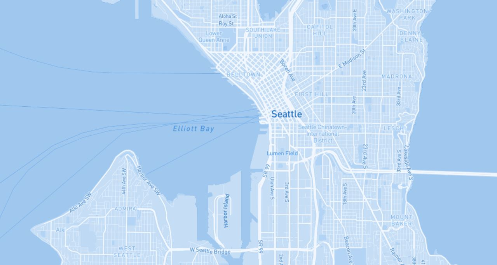

The best place to access these tilesets is https://adam-nicewarner.github.io/VariedTilesets/

The primary area for this is seattle, as it is where I currently live and know the most about. Each of these tilesets has a zoom level of 1-14, and have some amount of unique qualities. The first basemap is mostly a default mapbox basemap, although I have modified the fonts and added visibility of the ferry routes, as seattle is a coastal city with plenty of islands, the ferry routes seemed important. The second map is one themed around county-level health outcomes from 1-10, with 1 being the best and 10 being the worst. The third is that county-level map, but with a basemap behind it. The final one is a queer basemap, themed around the trans flag colors. 

